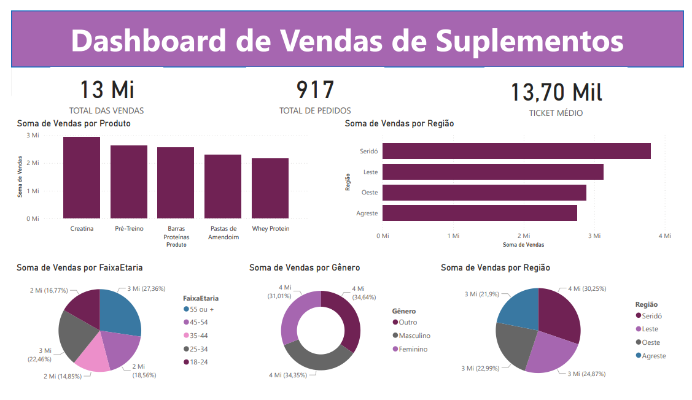

# Dashboard-de-Vendas-Power-BI

## Sobre o Projeto

Este projeto consiste na criação de um dashboard interativo de análise de vendas desenvolvido no Power BI com o objetivo de transformar dados comerciais em informações estratégicas para apoio à tomada de decisão.

A solução permite acompanhar indicadores de desempenho, identificar tendências de faturamento, analisar produtos mais vendidos e monitorar o comportamento das vendas ao longo do tempo.

---

## Objetivos

* Monitorar o desempenho comercial da empresa.
* Analisar a evolução das vendas.
* Identificar os produtos com melhor desempenho.
* Acompanhar indicadores estratégicos (KPIs).
* Apoiar decisões baseadas em dados.

---

## Tecnologias Utilizadas

* Power BI
* Power Query
* DAX
* Excel / CSV
* Modelagem de Dados

---

## Indicadores Monitorados

* Faturamento Total
* Quantidade de Vendas
* Ticket Médio
* Produtos Mais Vendidos
* Evolução Mensal das Vendas
* Participação por Categoria

---

## Principais Análises

### Análise Temporal

Permite visualizar a evolução das vendas ao longo do tempo e identificar períodos de crescimento ou queda.

### Performance de Produtos

Identifica os produtos responsáveis pela maior parcela do faturamento e volume de vendas.

### Indicadores Comerciais

Acompanhamento dos principais KPIs utilizados para monitoramento do desempenho comercial.

---

## Aprendizados

Durante o desenvolvimento deste projeto foram aplicados conhecimentos de:

* Tratamento e transformação de dados.
* Modelagem dimensional.
* Criação de medidas DAX.
* Construção de visualizações interativas.
* Desenvolvimento de dashboards para Business Intelligence.
